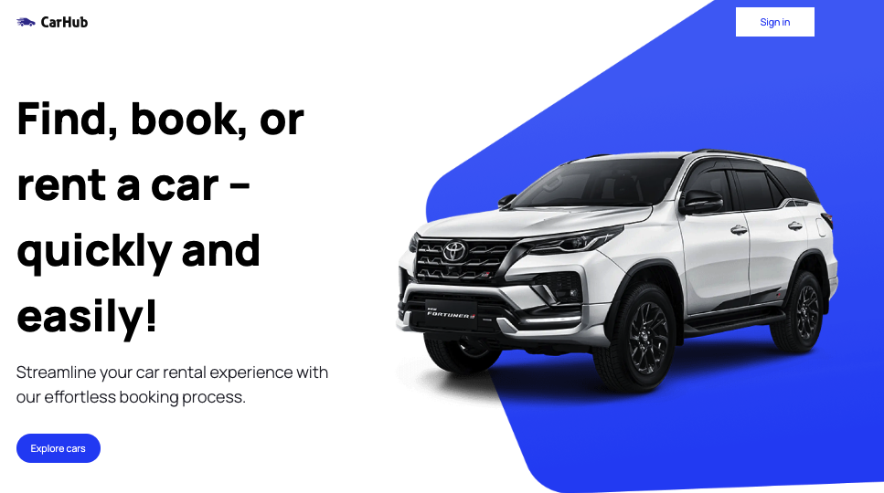

# CarHub showcase
This is a demo single page application. You can find and rent a car from the list. To search for a car, you can additionally use the year of production and the type of fuel.
To obtain data on the car are used API from Rapidapi.com - [Cars by API-Ninjas](https://rapidapi.com/apininjas/api/cars-by-api-ninjas/) and [Car Imagery API](https://www.imagin.studio/car-image-api) to obtain images from different angles.


<span>

</span>
<span>

</span>

### SPA built using:
 - [Next.js Documentation](https://nextjs.org/docs)
 - Deploy on [Vercel](https://vercel.com)
 - [Tailwindcss](https://tailwindcss.com/) - A utility-first CSS framework
 - [Headlessui](https://headlessui.com/) - UI components, designed to integrate  with Tailwind CSS

## Getting Started

1. Clone this repository:

```bash
git clone https://github.com/Tinkkid/next-js-cars.git
```

2. Install all dependencies:

```bash
npm install
```

3. Set up the necessary environment variables in the .env file.
4. Start project:

```bash
npm run dev
```

5. Open [http://localhost:3000](http://localhost:3000) with your browser to see the result.

## Live page
Open page - use link [next-js-cars.vercel.app](https://next-js-cars.vercel.app/)
